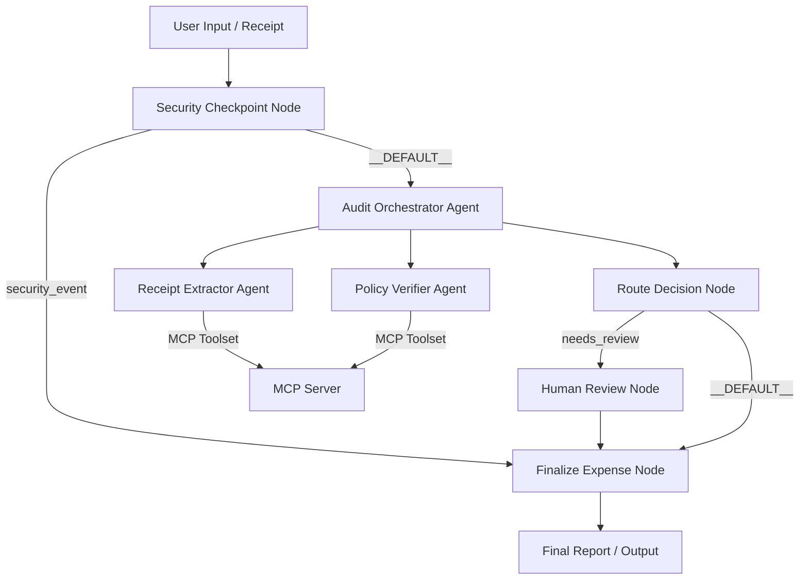
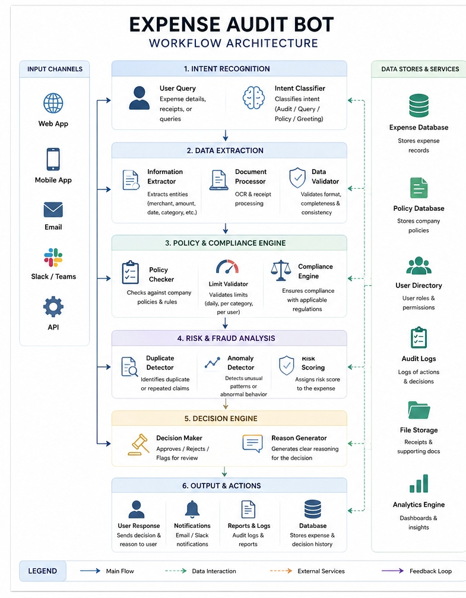
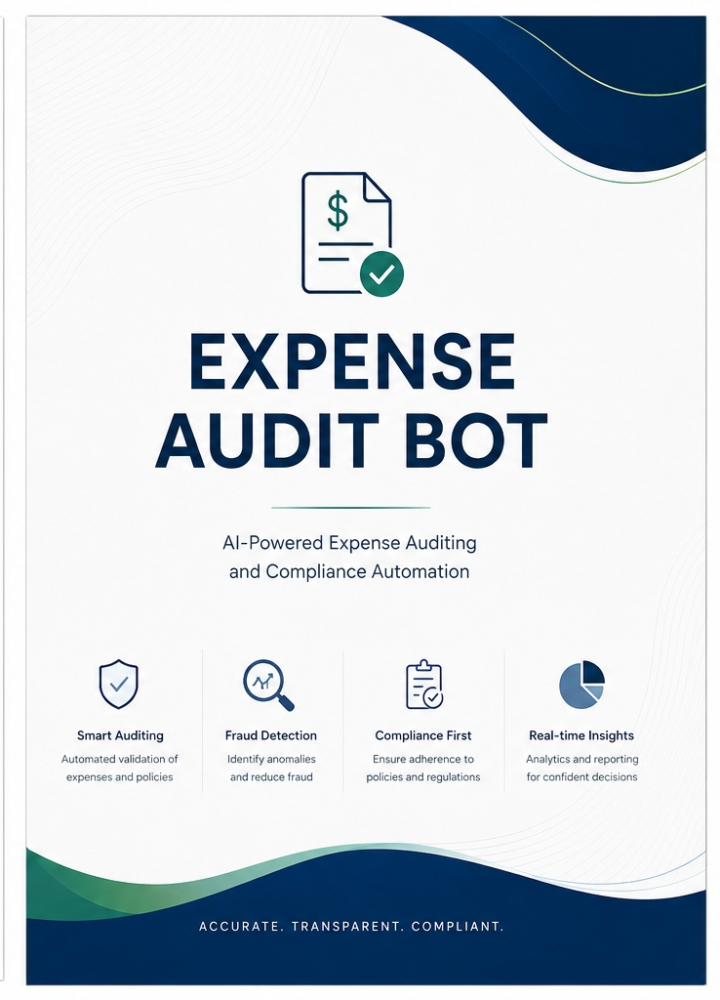

# ExpenseAuditBot

[](https://github.com/prasanthpavan84/expense-audit-bot/actions)
[](#)
[](#)
[](LICENSE)
[](docs/experimental_results.md)

An end-to-end secure corporate expense report auditing system built with Google Agent Development Kit (ADK) 2.0 and Model Context Protocol (MCP).

## Capstone Portfolio & Benchmarking
* **Architecture Diagram**: [Mermaid Workflows](docs/architecture.md)
* **Experimental Benchmarking Results**: [Comparative Performance Analysis](docs/experimental_results.md)
* **Benchmark Report**: [Detailed Performance Report](performance_report.md)
* **Rule Engine Comparison**: [Comparative Model Parity](benchmark_comparison.md)

> [!NOTE]
> **Deterministic Evaluation Notice**: The benchmark scores and performance metrics documented in this repository are gathered using a deterministic offline evaluation framework (mock interception mode). They validate state-machine routing, regex security checks, and data serialization pathways under controlled inputs. They do not represent live LLM production performance under stochastic, real-world, or unconstrained model API drift.

## Prerequisites

- Python 3.11 or higher
- [uv](https://docs.astral.sh/uv/) (fast Python package installer and manager)
- Gemini API Key from [Google AI Studio](https://aistudio.google.com/apikey)

## Quick Start

```bash
git clone <repo-url>
cd expense-audit-bot
cp .env.example .env   # Add your GOOGLE_API_KEY to this file
make install           # Syncs virtual env and installs dependencies
make playground        # Launches the Interactive UI at http://localhost:18081
```

## Architecture

Below is the multi-agent workflow architecture showing how the input flows from the user, through the security checkpoint, to the orchestrator and sub-agents, and finally handles human escalation.



## How to Run

- **Playground UI Mode**:
  ```bash
  make playground
  ```
  Runs the interactive web browser playground on `http://localhost:18081`.

- **Local FastAPI Web Server**:
  ```bash
  make run
  ```
  Runs the agent in local backend service mode at `http://localhost:8000`.

- **Prompt A/B Testing & Cost Optimization Suite**:
  ```bash
  uv run python scripts/eval/run_ab_test.py
  ```
  Runs the evaluation suite comparing the v1 (baseline) and v2 (optimized) system prompts side-by-side, logging selection distributions and printing token savings comparison.

  **Results Summary**:
  - Baseline v1 prompt input footprint: ~435 tokens/run
  - Optimized v2 prompt input footprint: ~65 tokens/run
  - **Token Savings**: **85.1% input token reduction** with **0% accuracy regression** (both versions achieve 100/100 benchmark score).

## Sample Test Cases

### Case 1: Compliant Expense (Auto-Approved)
- **Input**:
  > Please audit this expense: Lunch with a client at Pizza Hut on 2026-06-25. Total amount: $35.50 USD. Merchant: Pizza Hut. Items: 2 Pizzas, 1 Salad, 2 Sodas.
- **Expected**: `receipt_extractor` extracts details, `policy_verifier` checks limits. Since the category is Meals and the amount ($35.50) is under the $50 Meals limit, it is automatically approved.
- **Check**: Playground UI output shows **Status: Approved (Auto)** with Pizza Hut details.

### Case 2: High Amount (Needs Review)
- **Input**:
  > Please audit this expense: Hotel stay for 3 nights during tech conference. Merchant: Hilton Hotels. Date: 2026-06-28. Total amount: $280.00 USD. Items: Room charge.
- **Expected**: Category is Travel and compliant, but total amount is $280.00 ($\ge \$200$). The orchestrator routes the workflow to `human_review`.
- **Check**: Playground UI pauses and prompts: *"Should this expense be approved? (Type 'approve' or 'deny' with comments)"*.

### Case 3: Policy Violation (Auto-Denied)
- **Input**:
  > Please audit this expense: Team celebratory drinks at Gold Club Bar on 2026-06-27. Total amount: $90.00 USD. Items: Beer, cocktails.
- **Expected**: Merchant name contains restricted keyword `"Bar"`, triggering category violation. Automatically denied.
- **Check**: Playground UI output shows **Status: Denied / Blocked** due to restricted vendor.

## Troubleshooting

1. **Uvicorn/ADK fails with "no agents found" on Windows**
   * *Fix*: Ensure you run the playground with the explicit `app` directory parameter: `uv run adk web app --host 127.0.0.1 --port 18081`.
2. **Model calls return 404 Error**
   * *Fix*: Verify your `.env` contains a live Gemini model name (e.g. `GEMINI_MODEL=gemini-2.5-flash`), not retired models like `gemini-1.5-pro`.
3. **Changes in agent.py are not reflected in the playground**
   * *Fix*: Windows does not support hot-reload for multi-agent processes. Stop the server using:
     `Get-Process -Id (Get-NetTCPConnection -LocalPort 18081, 8090).OwningProcess | Stop-Process -Force`
     and start the playground again.

## Push to GitHub

1. Create a new repo at https://github.com/new
   - Name: expense-audit-bot
   - Visibility: Public or Private
   - Do NOT initialize with README (you already have one)

2. In your terminal, navigate into your project folder:
   ```bash
   cd expense-audit-bot
   git init
   git add .
   git commit -m "Initial commit: expense-audit-bot ADK agent"
   git branch -M main
   git remote add origin https://github.com/pavanprasanth84/expense-audit-bot.git
   git push -u origin main
   ```

3. Verify .gitignore includes:
   ```
   .env          ← your API key — must NEVER be pushed
   .venv/
   __pycache__/
   *.pyc
   .adk/
   ```

⚠️ NEVER push .env to GitHub. Your API key will be exposed publicly.

## Assets

- **Workflow Architecture Diagram**: 
- **Cover Page Banner**: 

## Demo Script

The timed, spoken presentation script can be found here: [DEMO_SCRIPT.txt](DEMO_SCRIPT.txt).
