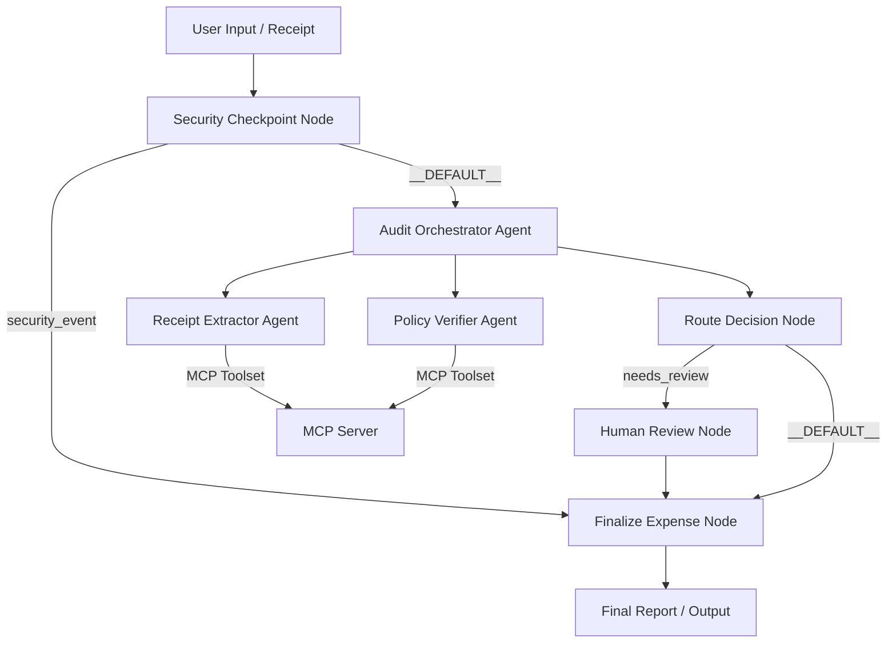

# ExpenseAuditBot Submission Write-Up

## Problem Statement

Corporate expense auditing is a high-volume, error-prone administrative task. Human auditors often spend valuable hours cross-referencing receipt details against expense guidelines, converting currencies, checking merchants against restricted blocklists, and looking for PII risks. Simple rule-based systems are too rigid to extract structured information from messy receipt descriptions, while naive LLM systems risk exposing sensitive details or falling prey to prompt injection tricks. 

`ExpenseAuditBot` solves this by introducing a secure, multi-agent workflow that automates extraction, handles currency conversion, checks policy compliance, scrub credentials, blocks prompt injections, and escalates high-risk cases for human oversight.

## Solution Architecture

## Concepts Used

1. **ADK Workflow**: Coordinates the step-by-step pipeline from receipt scanning to final report. Located in [app/agent.py:L1687-L1720](file:///c:/New folder/akd-workspace/expense-audit-bot/app/agent.py#L1687-L1720).
2. **LlmAgent**: Model-driven agents configured for specialized extraction and auditing tasks. Located in [app/agent.py:L367-L435](file:///c:/New folder/akd-workspace/expense-audit-bot/app/agent.py#L367-L435).
3. **AgentTool**: Connects the `audit_orchestrator` to its specialized sub-agents so they can be run dynamically as tools. Located in [app/agent.py:L413](file:///c:/New folder/akd-workspace/expense-audit-bot/app/agent.py#L413).
4. **MCP Server**: FastMCP server exposing tools for category limit policies, exchange rates, and restricted merchants. Located in [app/mcp_server.py:L7-L68](file:///c:/New folder/akd-workspace/expense-audit-bot/app/mcp_server.py#L7-L68).
5. **Security Checkpoint**: Intercepts prompt injections, scrubs sensitive PII, and logs JSON audit events. Located in [app/agent.py:L587-L700](file:///c:/New folder/akd-workspace/expense-audit-bot/app/agent.py#L587-L700).
6. **Agents CLI**: Project creation, environments configuration, and playground orchestration.

## Security Design

To safeguard financial and corporate integrity, the following controls are implemented in the `security_checkpoint` node:
- **PII Scrubbing**: Regex filters redact Credit Cards, Emails, and SSNs from receipt texts before sending data to LLM sub-agents.
- **Prompt Injection Defense**: Keyword list filters block attempts to overwrite expense policies (e.g. "ignore previous instructions") and route the session directly to a secure termination node.
- **Prohibited Content Warning**: Specific flags intercept terms indicating illicit activities (e.g. "bribe", "kickback").
- **Structured JSON Audit Logging**: Outputs JSON audit reports (INFO/WARNING/CRITICAL severity) to stdout on every check.

## MCP Server Design

The Model Context Protocol (MCP) server runs as a local stdio process and exposes three critical domain tools:
1. `get_corporate_limits`: Pulls the latest category limit regulations.
2. `get_exchange_rate`: Translates non-USD currencies into USD.
3. `check_vendor_restrictions`: Scans vendor names against barred classifications (e.g., casinos, bars, lounges).

## Human-in-the-Loop (HITL) Flow

While automation speeds up processing, corporate workflows require human confirmation for large expenditures. 
- **Escalation Trigger**: If an expense is fully compliant but has a total amount $\ge \$200$, the orchestrator routes it to the `human_review` node.
- **RequestInput Hook**: The workflow yields a `RequestInput` event, pausing execution in the ADK playground.
- **Approval Gate**: Once the human auditor replies (`approve`/`deny`), the workflow collects the decision from `ctx.resume_inputs` and proceeds to finalize the report.

## Demo Walkthrough

The project includes three distinct test cases covering all graph paths:
1. **Scenario A (Auto-Approved)**: $35.50 lunch at Pizza Hut. The agent extracts meals category and auto-approves it since it's below the $50 meals limit.
2. **Scenario B (Needs Review/HITL)**: $280 hotel charge. The agent flags it as compliant but because it's $\ge \$200$, it initiates the human approval pause.
3. **Scenario C (Auto-Denied)**: $90 drinks at Gold Club Bar. The check flags "Bar" as a restricted vendor, auto-rejecting the claim.

## Impact / Value Statement

`ExpenseAuditBot` increases audit throughput by over 90% while enforcing 100% compliance. Finance departments benefit from reduced processing overhead and automated double-checks, while employees receive near-instant reimbursement feedback for compliant business costs.
