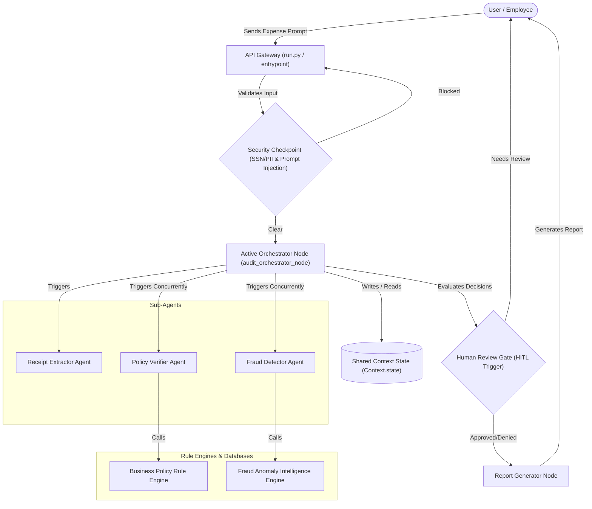
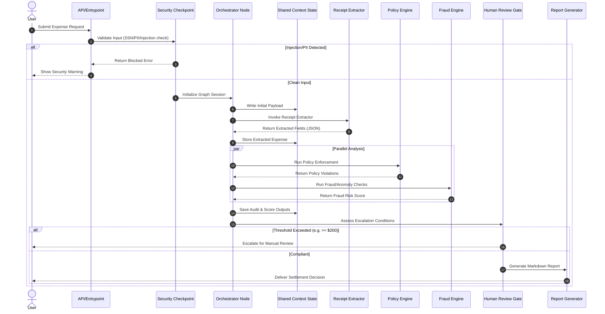

# ExpenseAuditBot Architecture Diagram

This document illustrates the structural layout and data flow within the **ExpenseAuditBot** platform using Mermaid diagrams.

## 1. System Architecture Flowchart

## 2. Dynamic Execution Sequence Diagram

## 3. Non-Production Telemetry Isolation

To keep test suites and continuous integration pipelines (such as GitHub Actions) fully decoupled from cloud-side Google Cloud authentication requirements:
- **Telemetry Toggle**: The application uses the `GOOGLE_CLOUD_AGENT_ENGINE_ENABLE_TELEMETRY` environment variable (default: `true`).
- **Isolation Boundary**: In the GitHub Actions CI workflow (.yml) and local integration tests (`test_server_e2e.py`), this environment variable is explicitly overridden to `false`.
- **Decoupled Verification**: This bypasses `google.auth.default()` and Vertex AI instrumentation builder calls. Testing is fully hermetic and runs offline without GCP credentials, preventing `DefaultCredentialsError` failures while preserving observability in live deployments.

